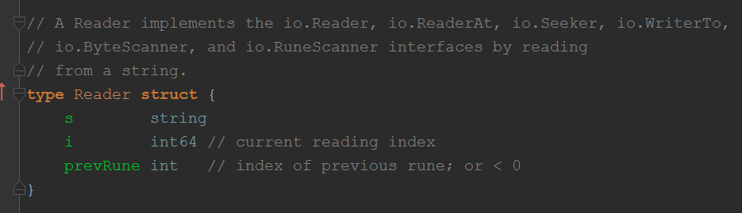
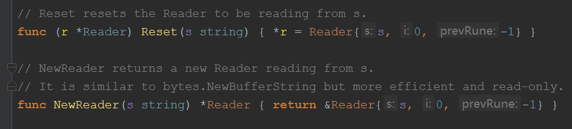

### reader

- 定义

> s: 用来读的字符串，一旦初始化后就不能修改
> i: 当前已读的byte数，初始为0
> prevRune:上一个Rune的索引，主要用来Unread Rune

- 方法
> 
>
> ```(r *Reader) Len() int``` : 未读部分的byte数
>
> ```(r *Reader) Size() int64```: s 的byte数
> 
> ```(r *Reader) Seek(offset int64, whence int) (int64, error)```: 调整i的值，即选取接下来要读取的位置
>
> ```(r *Reader) Read(b []byte) (n int, err error)```: 读取len(b)个字节到b，
> 不足(读到末尾)不会返回错误，但下次再读会直接返回```io.EOF```，通过这个可以判断已全部读取
> 
> ```(r *Reader) ReadByte() (byte, error)```: 读取一个byte
>
> ```(r *Reader) UnreadByte() error``` : 回退一个byte
>
> ```(r *Reader) ReadRune() (ch rune, size int, err error)```： 读取一个unicode字符
>
> ```(r *Reader) UnreadRune() error```: 回退一个unicode字符
>
> ```(r *Reader) WriteTo(w io.Writer) (n int64, err error)```: 和Read类似，只不过写入的是io.Writer， 
> 不足会返回```io.ErrShortWrite```
>
> ```(r *Reader) ReadAt(b []byte, off int64) (n int, err error)```: 从offset起读取len(b)个字节到b，这个不影响i的值
> 不足(读到末尾)会返回```io.EOF```

- 注意
> 注意```io.EOF```是个error，但是它只是读完了，并不是读的时候出错了，
> 所以不能简单的用```err != nil```来判断,
> 必须先排除掉```err == io.EOF``` 的情况


