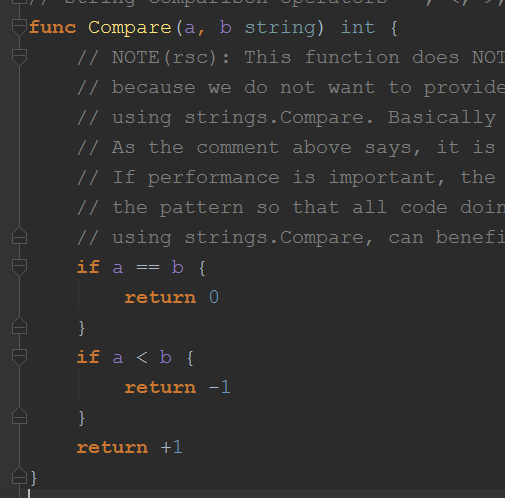
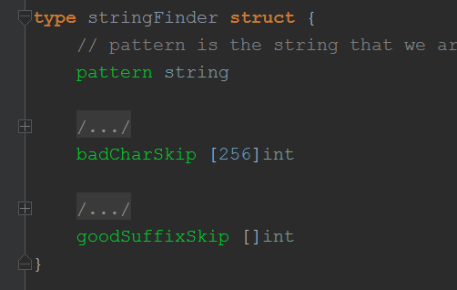
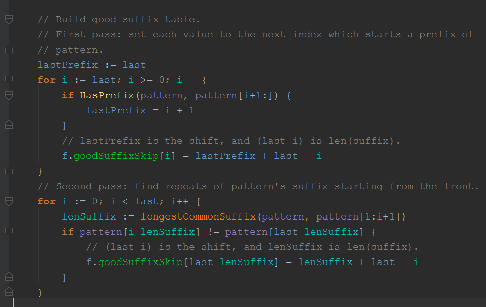
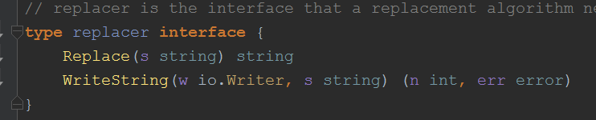
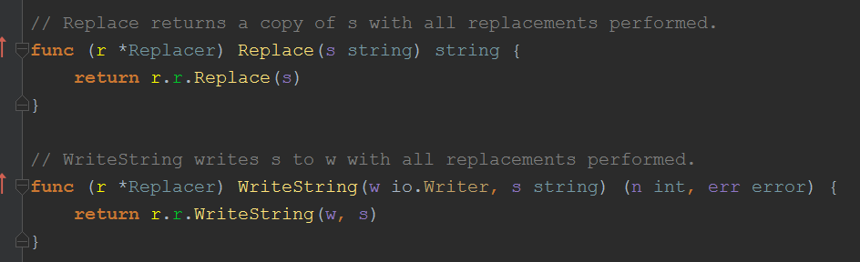
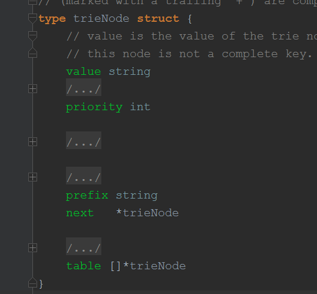
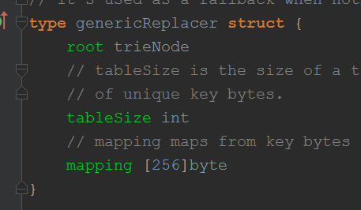
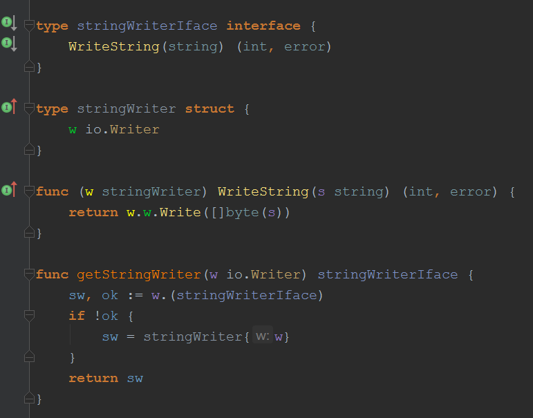

### replacer

#### compare.go
> 只有一个compare方法,但是不建议用这个方法，有这个方法主要为了跟bytes包对称
> 

#### search.go 
> 使用Boyer-Moore string search algorithm(BM算法)匹配字符串，这里查找的时候只匹配一次，即找到相应的字符串就返回，如果要继续查找，则继续传入参数```s[match:]```即可
> 
> 需要构造坏字符表和好后缀表， 好后缀构造代码如下
> 

#### replace.go 字符串替换
- 定义
> 
> 接下来定义了四个结构体并实现了replace接口
>
> singleStringReplacer: 
> 单个字符串替换，即只有一个旧字符串需要替换为新字符串，使用了前面的stringFinder来查找相应的旧字符串。 使用了append生成新字符串
>
> genericReplacer: 
> 字符串组的替换，所有旧字符串都为字符串(而不是byte),使用了字典树匹配旧字符串
>
> byteReplacer:
> 多组byte的替换
>
> byteStringReplacer：
> 旧byte替换为新string或byte，使用了copy生成新字符串，应该是考虑到新的byte用append不太合适(append会先复制，而copy则直接写入)

- NewReplacer(oldnew ...string) *Replacer 
> 首先 传入的字符串数据格式为 ```[]stirng{old1, new1, old2,new2,...}```
>
> 通过传入的字符串数据的具体情况，决定要生成的是上面的哪一个replacer,具体如下：
> * oldnew 长度为2，且旧字符串不为byte --> singleStringReplacer
> * 多个替换组，且所有旧字符串不为byte --> genericReplacer
> * 所有旧的为byte，所有新的也为byte --> byteReplacer
> * 所有旧的为byte，所有新的不全为byte --> byteStringReplacer
>
- (r *Replacer) Replace(s string) string
- (r *Replacer) WriteString(w io.Writer, s string)
> 

##### genericReplacer 
- 使用了前缀数(字典树)的方法查找旧字符串的位置
> 
> value: 新字符串的值
> 
> priority: 优先级，旧字符串的位置越靠前，优先级越高,解决了旧字符串重叠的问题
> 
> 如果只有一个子节点，则prefix保存剩余的后缀，next指向子节点
> 
> 如果有多个子节点，则prefix为空字符串，子节点保存在table里
>
> add(构建) 和 lookup(查找) 可以学习
- genericReplacer
> 
> tableSize 记录了所有旧字符串总共包含多少字符
>
> mapping 为这些字符编号(从0开始)，没有则为tableSize
>
> 额外说明：trieNode里面的table容量都为tableSize，
> 然后某个子节点的字符的索引(编号)相对应table的索引，
> 可以看到字符最多只有256个，如果字符串特别多，
> 那么table作为数组更容易查找出对应的子节点，其次，减少了存储子节点对应字符的空间

##### stringWriter
- 自定义替换

> 首先定义了一个 ```stringWriterIface``` 接口，
> 然后```stringWriter``` 利用了```io.Writer.Write()```实现了这个接口
> 
> 再由```getStringWriter```方法进行选择，
> 如果传入的io.Write已实现了这个接口，则直接调用他自己实现的方法(实现了自定义替换)，
> 如果没有也不要紧，因为有自身的```Write()```方法可以利用(即调用)```stringWriter```的方法

