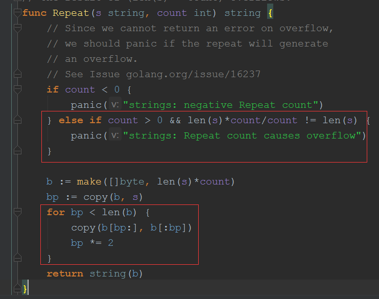

### strings 

##### Rabin-Karp algorithm
> todo 
>

##### Repeat

> 通过乘以count 然后再除以count 后是否相等来判断数据是否溢出
>
> 先限定的最终复制的长度(即b的长度)，然后进行指数的复制```copy(b[bp:], b[:bp])```，
> 利用了copy的特性，即复制的长度为```min(len(dsc),len(rsc))```


#### 参考
[Go标准库strings中的一些容易令人混淆的方法](https://mp.weixin.qq.com/s?__biz=MjM5NDA1MjMzMA==&mid=400827162&idx=1&sn=bb0cfab4872e1767828c82df5c396d82)