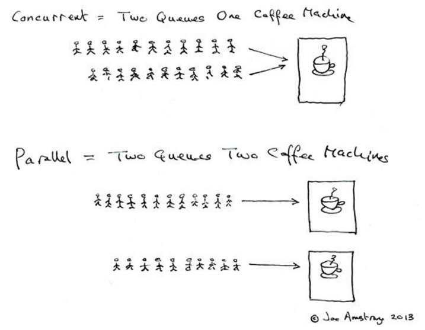
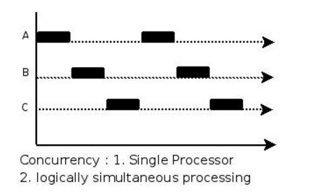
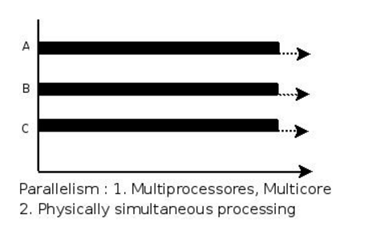
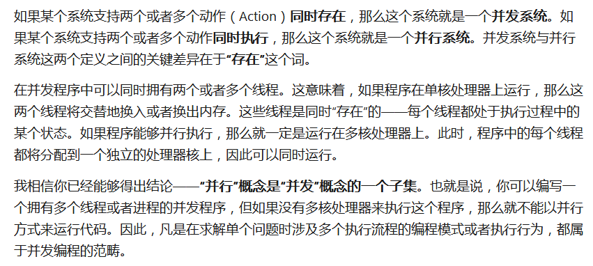

### 并行与并发

#### 总结
> 并发是指一个处理器同时处理多个任务。 
>
> 并行是指多个处理器或者是多核的处理器同时处理多个不同的任务。 
>
> 并发是逻辑上的同时发生,而并行是物理上的同时发生。 来个比喻：并发是一个人同时吃三个馒头，而并行是三个人同时吃三个馒头。
> 

#### 并发(concurrency)
> 一个处理器在宏观上同时跑多个进程，实际上在同一时刻只有一条指令执行，即多个进程指令被快速的轮换执行
> 

#### 并行(parallel)
> 在同一时刻，有多条指令在多个处理器上同时执行
> 

#### 《并发的艺术》 — 〔美〕布雷谢斯
> 

#### 参考
* [并发与并行的区别](http://blog.csdn.net/java_zero2one/article/details/51477791)
* [并发与并行的区别](https://www.bughui.com/2017/08/23/difference-between-concurrency-and-parallelism/) 
