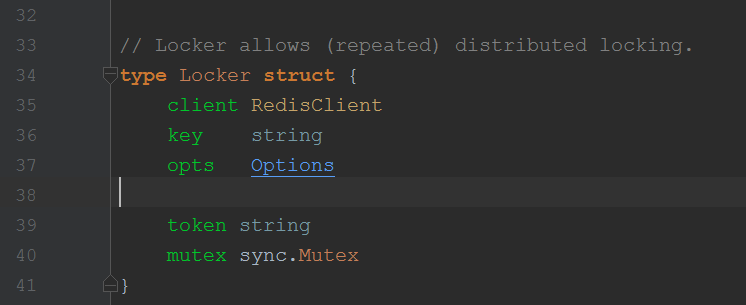
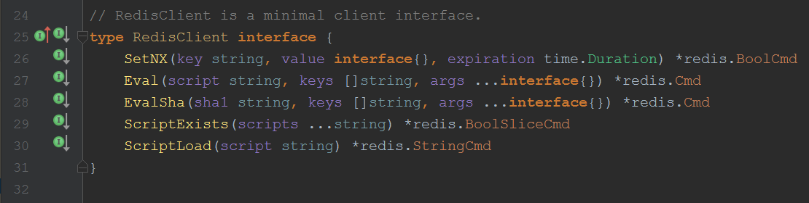
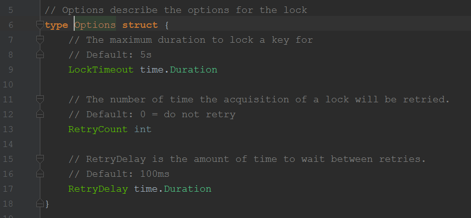
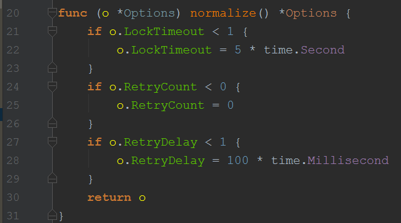

### redis-lock

#### 模块基础了解
* ```import "github.com/bsm/redis-lock"```
* 需要 redis client ```import "github.com/go-redis/redis"```

#### 源码分析
###### 结构体定义
- Locker
 > 
 > 显然，Locker需要一个 redis client 来进行加锁，使用的是redis的```SetNX```命令
 >
 > key 是加锁用的字符串，相同字符串即请求相同的锁，可以理解为锁的名字，key相同的Locker之间会相互排斥，同一个Locker重复申请锁，则只会刷新这个锁
 >
 > opts 是锁的相关设置
 >
 > token 相当于一个标志，如果是空字符串则表示该Locker未加锁，非字符串表示已加锁且未主动释放锁，但是此锁可能已过期，同时根据这个字段判断申请锁的时候是要refresh还是create
 >
 > mutex 暂时不是很了解这个模块，感觉是对代码加锁，防止多个线程同时操作
 >
 
- RedisClient
 > 
 > ```SetNx```命令是加锁最核心的命令，"SET if Not Exists",
 > 涉及到过期时间，实际上用的是```set```
 >
 > 接下来四个方法不是很懂，程序中好像也没用到，不知道SetNx方法中有没有用到 todo 
 >
 > 注意，这是一个接口，那是不是意味着只要client实现了这几个接口就可以使用redis-lock，不一定非要要redis？

- Opts 
 > 
> 图片中的注释很清楚了，但是它还有一个```normalize```方法实现默认赋值，这可以学习
> 

###### 程序对外方法
*  ```New(client RedisClient, key string, opts *Options) *Locker```
    > 初始化锁，如无Opts,设置默认配置
* ```(l *Locker) Lock() (bool, error)```
    > 进行加锁 使用默认context， context 可以在任何时刻结束阻塞等待锁的线程,这里使用默认context预示着我们不打算自己去结束阻塞的线程，只能等到配置的等待时间到达
* ```(l *Locker) LockWithContext(ctx context.Context) (bool, error)```
    > 使用自己的context加锁，可以在任何时刻主动结束线程，注意，返回值bool指示加锁是否成功
* ```(l *Locker) Unlock() error```
    > 解锁
* ```(l *Locker) IsLocked() bool```
    > 查看是否被解锁，此处是通过判断token是否为空字符串来判断的，注意token为非空时，说明未被主动解锁，但是可能此锁已过期
* ```Obtain(client RedisClient, key string, opts *Options) (*Locker, error)```
    > 初始化锁，并加锁
* ```Run(client RedisClient, key string, opts *Options, handler func() error)```
    > 初始化锁并加锁，成功后直接执行传入的方法
##### 总结 
* 过期时间: 防止持有锁的进程崩溃，锁一直无法释放
* token 随机数，防止一个进程的锁已失效，并被其他进程取得，此进程再去释放锁的时候误删了别人的锁
* 由此要使用lua脚本，保证执行的原子性
> 举个例子，一个进程要释放锁，检查锁有效并且是自己的锁，
> 然后在他删除操作之前，锁失效了，而且被另一个进程获得，
> 结果是，这个别的进程的锁就被删除了
* 

#### redisLock知识点
* Redis为单进程单线程模式，采用队列模式将并发访问变成串行访问，且多客户端对Redis的连接并不存在竞争关系
* 注意以上的redisLock 的实现方法并不是唯一的,还可以使用其他redis命令如```GetSet```等实现锁
* 分布式的锁还要考虑Redis的master节点宕机的情况
> [Redis学习笔记（六）redis实现分布式锁](http://blog.csdn.net/liubenlong007/article/details/53782934)
> [官方文档 Distributed locks with Redis](https://redis.io/topics/distlock)

#### 其他参考资料
[redis setnx 实现分布式锁和单机锁](http://blog.csdn.net/pzqingchong/article/details/52516602)
[基于Redis实现分布式锁](http://blog.csdn.net/ugg/article/details/41894947)

#### 其他学习点
* mutex -- 加锁
* context -- 上下文，结束进程 -- select/chan
* time.Timer -- 定时器
* redis.NewScript -- lua 脚本
* rand.Read -- 随机数产生


